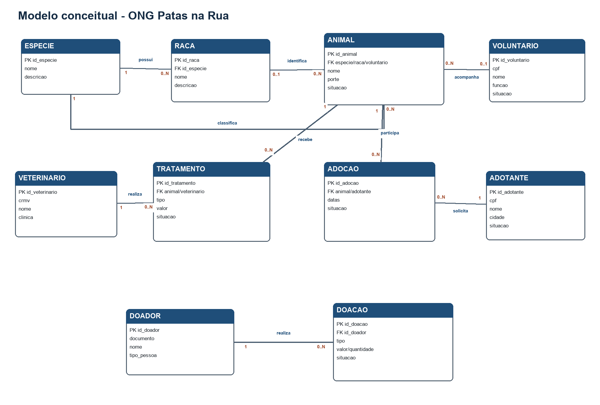
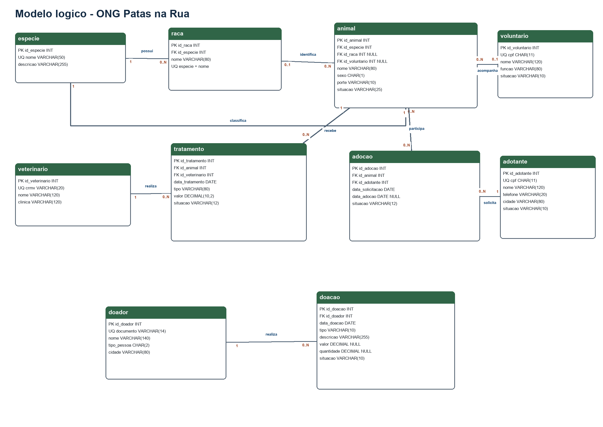

# Projeto de Banco de Dados Patas na Rua

## Identificação

- Aluno: Isaac Azevedo Werneck
- Matrícula: 2024101179
- Modalidade: individual
- SGBD: MySQL 8.0

## Descrição do minimundo

A organização não governamental Patas na Rua atua no resgate, tratamento e encaminhamento para adoção de animais abandonados, principalmente cães e gatos, podendo receber outros pequenos animais. Atualmente, informações sobre resgates, atendimentos veterinários, candidatos à adoção, voluntários e doações ficam dispersas em planilhas, formulários e conversas por aplicativos de mensagens. Isso dificulta localizar o histórico de cada animal, acompanhar tratamentos, controlar processos de adoção e prestar contas das contribuições recebidas.

O projeto propõe um banco de dados relacional que centraliza essas informações. Cada animal recebe um cadastro com espécie, raça quando conhecida, características, dados do resgate, situação atual e voluntário responsável. Os atendimentos registram o profissional, o diagnóstico, o procedimento, o custo e a necessidade de retorno.

As pessoas interessadas em adotar são cadastradas como adotantes. Cada processo relaciona um adotante a um animal e registra solicitação, análise, conclusão, situação e observações. O banco também controla voluntários, doadores e doações financeiras ou materiais.

Com a solução, a ONG poderá consultar animais disponíveis, acompanhar gastos veterinários, recuperar o histórico de adoções, identificar responsáveis e consolidar doações por período.

## Público atendido

- gestores da ONG;
- voluntários;
- veterinários parceiros;
- adotantes;
- doadores;
- animais resgatados, como beneficiários finais.

## Regras de negócio

1. Cada animal possui um cadastro único e pertence obrigatoriamente a uma espécie.
2. Uma raça pertence a uma espécie, mas a raça do animal pode ficar sem identificação.
3. A raça informada para um animal deve pertencer à mesma espécie cadastrada para ele.
4. A situação do animal pode ser `EM_TRATAMENTO`, `DISPONIVEL_ADOCAO`, `EM_PROCESSO_ADOCAO`, `ADOTADO` ou `FALECIDO`.
5. Um voluntário pode acompanhar vários animais; um animal pode ter no máximo um voluntário responsável por vez.
6. Um animal pode receber vários tratamentos, e cada tratamento é realizado por exatamente um veterinário.
7. O custo do tratamento não pode ser negativo.
8. Cada adotante possui documento único e pode participar de vários processos de adoção.
9. Cada processo de adoção relaciona exatamente um animal e um adotante.
10. Apenas um processo de adoção pode permanecer ativo para o mesmo animal.
11. Uma adoção pode ficar `EM_ANALISE`, `APROVADA`, `RECUSADA`, `CANCELADA` ou `CONCLUIDA`.
12. Ao concluir uma adoção, a situação do animal passa para `ADOTADO`.
13. Um doador pode realizar várias doações; cada doação pertence a um único doador.
14. Uma doação financeira deve possuir valor positivo.
15. Uma doação material deve possuir descrição, quantidade e unidade.
16. Registros de adoções, tratamentos e doações devem ser preservados como histórico.
17. Os dados pessoais usados na demonstração são fictícios.

## Modelo conceitual

### Entidades

| Entidade | Identificador | Finalidade |
|---|---|---|
| Espécie | `id_especie` | Classifica os animais e as raças. |
| Raça | `id_raca` | Mantém as raças por espécie. |
| Voluntário | `id_voluntario` | Registra as pessoas que apoiam a ONG. |
| Animal | `id_animal` | Centraliza os dados dos animais resgatados. |
| Veterinário | `id_veterinario` | Identifica os profissionais parceiros. |
| Tratamento | `id_tratamento` | Registra o histórico clínico e seus custos. |
| Adotante | `id_adotante` | Armazena os candidatos à adoção. |
| Adoção | `id_adocao` | Representa o processo entre animal e adotante. |
| Doador | `id_doador` | Identifica pessoas e organizações doadoras. |
| Doação | `id_doacao` | Registra contribuições financeiras e materiais. |

### Relacionamentos e cardinalidades

| Origem | Relacionamento | Destino | Cardinalidade |
|---|---|---|---|
| Espécie | possui | Raça | `1:N` |
| Espécie | classifica | Animal | `1:N` |
| Raça | identifica | Animal | `1:N`, opcional no animal |
| Voluntário | acompanha | Animal | `1:N`, opcional no animal |
| Animal | recebe | Tratamento | `1:N` |
| Veterinário | realiza | Tratamento | `1:N` |
| Animal | participa | Adoção | `1:N` |
| Adotante | solicita | Adoção | `1:N` |
| Doador | realiza | Doação | `1:N` |

## Modelo lógico

### Dicionário resumido

#### `especie`

- `id_especie INT`: chave primária.
- `nome VARCHAR(50)`: nome único e obrigatório.
- `descricao VARCHAR(255)`: explicação opcional.

#### `raca`

- `id_raca INT`: chave primária.
- `id_especie INT`: chave estrangeira para `especie`.
- `nome VARCHAR(80)`: nome obrigatório.
- `descricao VARCHAR(255)`: explicação opcional.
- A combinação `id_especie + nome` é única.

#### `voluntario`

- `id_voluntario INT`: chave primária.
- `nome VARCHAR(120)`, `cpf CHAR(11)`, `telefone VARCHAR(20)` e `email VARCHAR(120)`.
- `funcao VARCHAR(80)`, `data_entrada DATE` e `situacao VARCHAR(10)`.
- O CPF é único.

#### `animal`

- `id_animal INT`: chave primária.
- `id_especie INT`: chave estrangeira obrigatória.
- `id_raca INT`: chave estrangeira opcional.
- `id_voluntario_responsavel INT`: chave estrangeira opcional.
- `nome`, `sexo`, `data_nascimento_estimada`, `porte`, `cor_pelagem`, `data_resgate`, `local_resgate`, `situacao` e `observacoes`.

#### `veterinario`

- `id_veterinario INT`: chave primária.
- `nome`, `crmv`, `telefone`, `email` e `clinica`.
- O CRMV é único.

#### `tratamento`

- `id_tratamento INT`: chave primária.
- `id_animal INT` e `id_veterinario INT`: chaves estrangeiras obrigatórias.
- `data_tratamento`, `tipo`, `diagnostico`, `descricao`, `valor`, `data_retorno` e `situacao`.

#### `adotante`

- `id_adotante INT`: chave primária.
- `nome`, `cpf`, `data_nascimento`, `telefone`, `email`, `endereco`, `cidade`, `data_cadastro` e `situacao`.
- O CPF é único.

#### `adocao`

- `id_adocao INT`: chave primária.
- `id_animal INT` e `id_adotante INT`: chaves estrangeiras obrigatórias.
- `data_solicitacao`, `data_analise`, `data_adocao`, `situacao` e `observacoes`.

#### `doador`

- `id_doador INT`: chave primária.
- `nome`, `tipo_pessoa`, `documento`, `telefone`, `email`, `cidade` e `data_cadastro`.
- O documento é único.

#### `doacao`

- `id_doacao INT`: chave primária.
- `id_doador INT`: chave estrangeira obrigatória.
- `data_doacao`, `tipo`, `descricao`, `valor`, `quantidade`, `unidade` e `situacao`.
- Restrições condicionais garantem os dados exigidos para doações financeiras e materiais.

## Operações avaliadas

O arquivo `sql/patas_na_rua.sql` contém:

- criação do banco e das dez tabelas;
- pelo menos cinco registros em cada tabela;
- consulta com duas tabelas, agregação e `GROUP BY`;
- consulta com três tabelas, agregação e `GROUP BY`;
- consulta com subconsulta;
- exemplo de `UPDATE`;
- exemplo de `DELETE` restrito a uma doação cancelada;
- stored procedure transacional para concluir uma adoção.

## Critérios atendidos

- [x] Descrição do minimundo.
- [x] Modelo conceitual com pelo menos oito entidades.
- [x] Modelo lógico relacional.
- [x] Script de criação das tabelas.
- [x] Cinco ou mais registros por tabela.
- [x] Consultas com duas e três tabelas e agregação.
- [x] Consulta com subconsulta.
- [x] Atualização e exclusão de dados.
- [x] Stored procedure.
- [x] Documento Word e PDF final.
